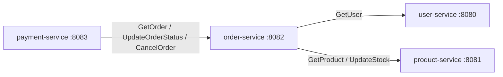
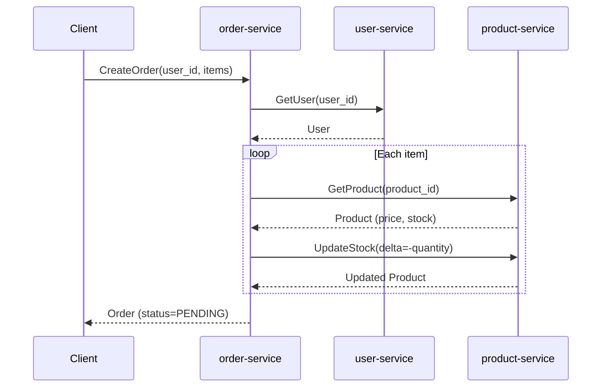
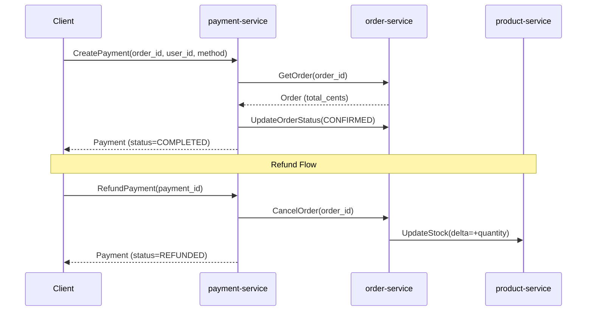
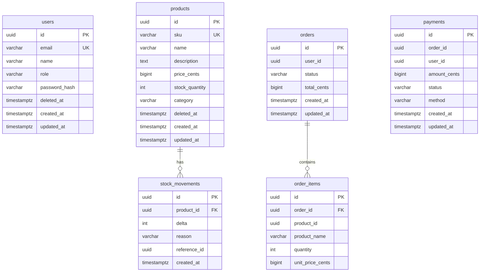

# Inventory Management Microservices

Go + [Connect RPC](https://connectrpc.com/) で構築した在庫管理マイクロサービスです。
学習目的で、サービス間通信・在庫管理・注文・決済といったドメインを Connect RPC のマイクロサービスとして実装しています。

## Architecture

```
                          +-----------------+
                          |   PostgreSQL    |
                          |  (5432)        |
                          +---+----+---+---+
                              |    |   |   |
                 +------------+    |   |   +------------+
                 |                 |   |                 |
          +------+------+  +------+------+  +------+------+  +------+------+
          | user-service |  |product-serv.|  |order-service|  |payment-serv.|
          |   :8080      |  |   :8081     |  |   :8082     |  |   :8083     |
          +------+-------+  +------+------+  +------+------+  +------+------+
                 |                 |                 |                 |
                 |                 |     Connect RPC |     Connect RPC |
                 |                 |    +------------+    +------------+
                 |                 |    |                 |
                 |                 +<---+  (stock check/  |
                 +<----------------------------deduct)    |
                   (user verify)   |                      |
                                   |         +------------+
                                   |         | (get order /
                                   |         |  update status)
                                   +<--------+
```

### Service Dependencies (Connect RPC)



### Sequence: Order Creation



### Sequence: Payment & Refund



## Tech Stack

| Category | Technology |
|----------|-----------|
| Language | Go 1.26 |
| RPC Framework | [Connect RPC](https://connectrpc.com/) (connectrpc.com/connect) |
| Protocol | Protocol Buffers v3 |
| Database | PostgreSQL 16 |
| DB Driver | [pgx](https://github.com/jackc/pgx) v5 (pgxpool) |
| Migration | [golang-migrate](https://github.com/golang-migrate/migrate) v4 |
| Code Generation | [Buf](https://buf.build/) CLI |
| API Docs | [protoc-gen-doc](https://github.com/pseudomuto/protoc-gen-doc) |
| Container | Docker Compose |

## Project Structure

```
.
├── proto/                          # Protocol Buffers definitions
│   ├── buf.yaml                    #   Buf module config
│   ├── buf.gen.yaml                #   Code generation config
│   ├── user/v1/user.proto
│   ├── product/v1/product.proto
│   ├── order/v1/order.proto
│   └── payment/v1/payment.proto
│
├── gen/                            # Generated Go code (buf generate)
│   ├── user/v1/                    #   message types + connect handlers
│   ├── product/v1/
│   ├── order/v1/
│   └── payment/v1/
│
├── internal/                       # Shared packages
│   ├── config/config.go            #   Environment-based configuration
│   └── db/db.go                    #   pgxpool connection setup
│
├── services/
│   ├── user/                       # User Service (:8080)
│   │   ├── cmd/server/main.go      #   Entrypoint
│   │   ├── internal/
│   │   │   ├── handler/            #   Connect RPC handler
│   │   │   └── repository/         #   PostgreSQL queries
│   │   └── migrations/             #   SQL migration files
│   │
│   ├── product/                    # Product Service (:8081)
│   │   ├── cmd/server/main.go
│   │   ├── internal/
│   │   │   ├── handler/
│   │   │   └── repository/
│   │   └── migrations/
│   │
│   ├── order/                      # Order Service (:8082)
│   │   ├── cmd/server/main.go
│   │   ├── internal/
│   │   │   ├── handler/            #   Calls user-service & product-service
│   │   │   └── repository/
│   │   └── migrations/
│   │
│   └── payment/                    # Payment Service (:8083)
│       ├── cmd/server/main.go
│       ├── internal/
│       │   ├── handler/            #   Calls order-service
│       │   └── repository/
│       └── migrations/
│
├── scripts/
│   ├── init-db.sh                  # Creates 4 databases on PostgreSQL init
│   ├── migrate.sh                  # Runs all migrations
│   └── gen-docs.sh                 # Generates API docs (HTML)
│
├── docs/
│   └── index.html                  # Auto-generated API documentation
│
├── docker-compose.yaml             # All services + PostgreSQL
├── Dockerfile                      # Multi-stage build (shared by all services)
├── Makefile
├── go.mod
└── go.sum
```

## Services

### User Service (`:8080`)

ユーザーの登録・管理を行うサービス。

| RPC | Description |
|-----|-------------|
| `CreateUser` | 新規ユーザー登録 (パスワードは bcrypt でハッシュ化) |
| `GetUser` | ID でユーザー取得 |
| `ListUsers` | ページネーション付きユーザー一覧 |
| `UpdateUser` | 名前・メールアドレスの更新 |
| `DeleteUser` | 論理削除 (soft delete) |

### Product Service (`:8081`)

商品カタログと在庫を管理するサービス。

| RPC | Description |
|-----|-------------|
| `CreateProduct` | 商品登録 (SKU はユニーク) |
| `GetProduct` | ID で商品取得 |
| `ListProducts` | カテゴリフィルタ付き商品一覧 |
| `UpdateProduct` | 商品メタデータ更新 (在庫以外) |
| `DeleteProduct` | 論理削除 |
| `UpdateStock` | 在庫数の増減 (`SELECT ... FOR UPDATE` で排他制御) |
| `GetStockLevel` | 現在の在庫数 + 直近の変動履歴 |

### Order Service (`:8082`)

注文を管理するサービス。user-service と product-service を Connect RPC で呼び出す。

| RPC | Description |
|-----|-------------|
| `CreateOrder` | 注文作成 (ユーザー確認 → 在庫確認 → 在庫引落 → 注文レコード作成) |
| `GetOrder` | ID で注文取得 (明細含む) |
| `ListOrders` | ユーザー・ステータスでフィルタ可能な注文一覧 |
| `UpdateOrderStatus` | 注文ステータスの手動更新 |
| `CancelOrder` | 注文キャンセル + 在庫復元 (product-service 経由) |

### Payment Service (`:8083`)

決済を管理するサービス。order-service を Connect RPC で呼び出す。

| RPC | Description |
|-----|-------------|
| `CreatePayment` | 決済実行 (注文取得 → 決済処理 → 注文ステータスを CONFIRMED に更新) |
| `GetPayment` | ID で決済取得 |
| `ListPayments` | 注文・ユーザーでフィルタ可能な決済一覧 |
| `RefundPayment` | 全額返金 (決済を REFUNDED → 注文をキャンセル → 在庫復元) |

> 決済処理は学習目的のためシミュレーション (常に成功) です。

## Database

各サービスが独立したデータベースを持つ Database-per-Service パターンを採用しています。

| Database | Service | Tables |
|----------|---------|--------|
| `user_db` | user-service | `users` |
| `product_db` | product-service | `products`, `stock_movements` |
| `order_db` | order-service | `orders`, `order_items` |
| `payment_db` | payment-service | `payments` |

### ER Diagram



> `orders.user_id` や `order_items.product_id` は他サービスの DB を参照するため、
> アプリケーションレベルの外部キーです (DB レベルの FK 制約はありません)。

## Getting Started

### Prerequisites

- [Docker](https://www.docker.com/) & Docker Compose
- [Go](https://go.dev/) 1.26+
- [Buf CLI](https://buf.build/docs/installation) (Proto コード生成用)

### Quick Start

```bash
# 1. Build & start all services
make build
make up

# 2. Check all containers are running
docker compose ps

# 3. Try the API (see Usage section below)
```

### Makefile Commands

| Command | Description |
|---------|-------------|
| `make build` | Docker イメージをビルド |
| `make up` | 全サービスをバックグラウンドで起動 |
| `make down` | 全サービスを停止 |
| `make down-v` | 全サービスを停止 + データ削除 |
| `make logs` | 全サービスのログを表示 |
| `make logs-user` | user-service のログを表示 |
| `make proto` | Proto ファイルから Go コードを再生成 |
| `make lint` | Proto ファイルの Lint |
| `make docs` | API ドキュメントを HTML で生成 |
| `make test` | テスト実行 |
| `make clean` | 停止 + データ削除 + 生成コード削除 |

## Usage

Connect RPC は JSON over HTTP をサポートしているため、`curl` でそのまま呼び出せます。

### 1. Create a User

```bash
curl -s -X POST http://localhost:8080/user.v1.UserService/CreateUser \
  -H "Content-Type: application/json" \
  -d '{
    "email": "tanaka@example.com",
    "name": "Tanaka Taro",
    "password": "pass1234",
    "role": "ROLE_CUSTOMER"
  }' | jq .
```

### 2. Create a Product

```bash
curl -s -X POST http://localhost:8081/product.v1.ProductService/CreateProduct \
  -H "Content-Type: application/json" \
  -d '{
    "sku": "LAPTOP-001",
    "name": "MacBook Pro",
    "description": "Apple laptop",
    "priceCents": 199900,
    "stockQuantity": 10,
    "category": "electronics"
  }' | jq .
```

### 3. Place an Order

```bash
# Replace <user_id> and <product_id> with actual UUIDs from steps 1 & 2
curl -s -X POST http://localhost:8082/order.v1.OrderService/CreateOrder \
  -H "Content-Type: application/json" \
  -d '{
    "userId": "<user_id>",
    "items": [
      {"productId": "<product_id>", "quantity": 2}
    ]
  }' | jq .
```

This call triggers cross-service communication:
- order-service -> user-service: verify user exists
- order-service -> product-service: check stock & deduct

### 4. Make a Payment

```bash
curl -s -X POST http://localhost:8083/payment.v1.PaymentService/CreatePayment \
  -H "Content-Type: application/json" \
  -d '{
    "orderId": "<order_id>",
    "userId": "<user_id>",
    "method": "PAYMENT_METHOD_CREDIT_CARD"
  }' | jq .
```

This call triggers: payment-service -> order-service: update status to CONFIRMED

### 5. Check Stock Level

```bash
curl -s -X POST http://localhost:8081/product.v1.ProductService/GetStockLevel \
  -H "Content-Type: application/json" \
  -d '{"productId": "<product_id>"}' | jq .
```

### 6. Refund Payment

```bash
curl -s -X POST http://localhost:8083/payment.v1.PaymentService/RefundPayment \
  -H "Content-Type: application/json" \
  -d '{"id": "<payment_id>"}' | jq .
```

This triggers a chain: payment-service -> order-service (cancel) -> product-service (restore stock)

## API Documentation

Proto ファイルのコメントから HTML ドキュメントを自動生成できます。

```bash
make docs
open docs/index.html
```

## Design Decisions

| Decision | Rationale |
|----------|-----------|
| **Database-per-Service** | 各サービスが独立してスキーマを管理。サービス間はアプリケーションレベルで参照 |
| **Money as int64 (cents)** | 浮動小数点の精度問題を回避。全金額フィールドに `_cents` サフィックス |
| **SELECT ... FOR UPDATE** | 在庫更新時の排他制御。同時注文によるオーバーセルを防止 |
| **Soft Delete** | ユーザー・商品は論理削除。注文履歴の整合性を維持 |
| **Stock Movements (audit trail)** | 在庫変動の全履歴を記録。在庫不整合のデバッグに活用 |
| **Denormalized product_name in order_items** | 注文時点の商品名を保持。後の商品名変更に影響されない |
| **Simulated payment** | 学習目的のため決済処理は常に成功するシミュレーション |
| **Shared Dockerfile with ARG** | 4サービスで1つの Dockerfile を共有。`SERVICE_NAME` ARG でビルド対象を切替 |
