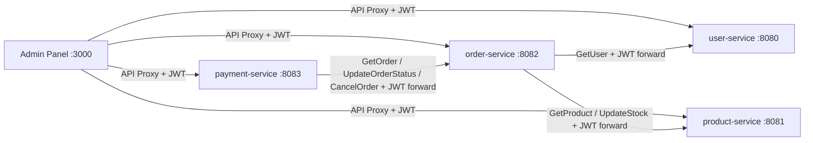
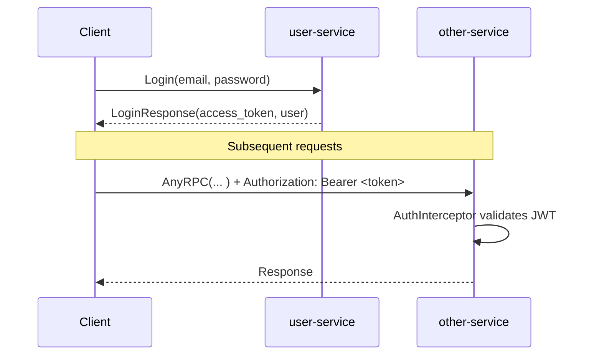
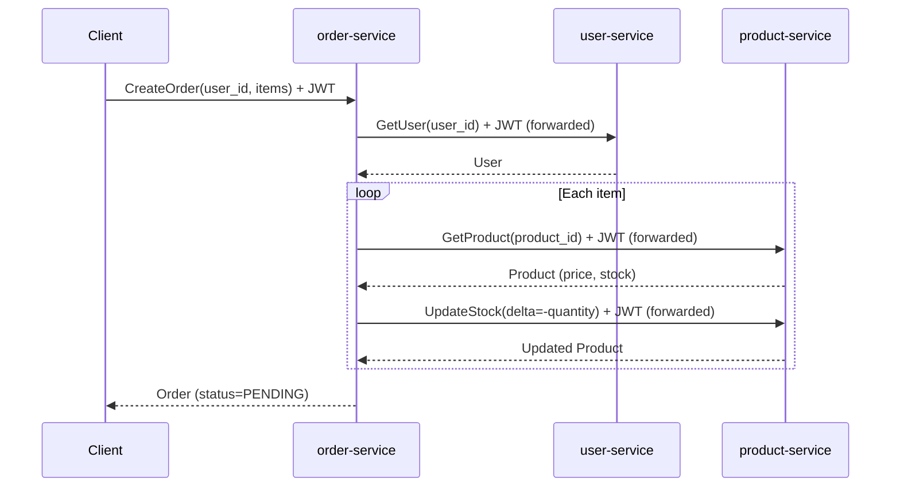
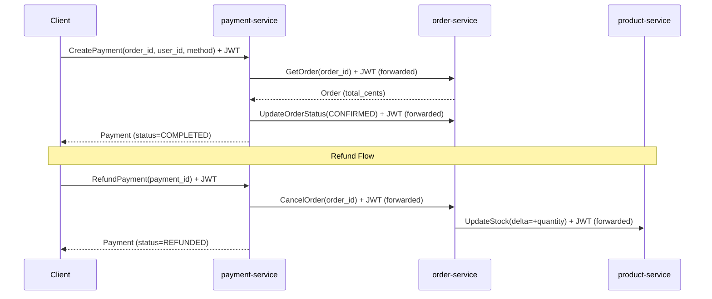
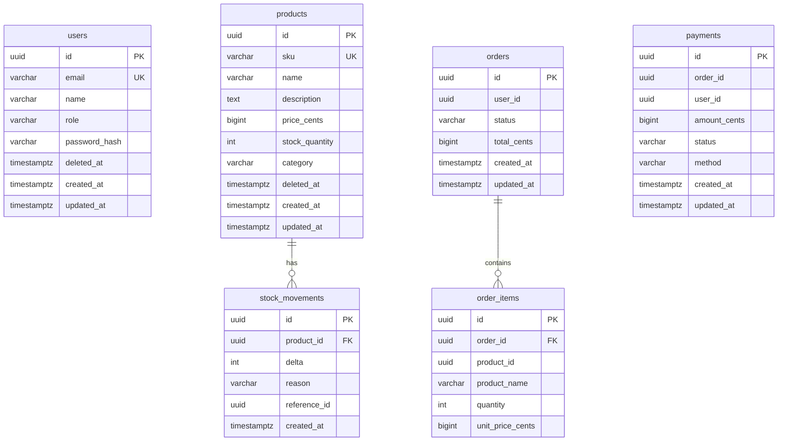

# Inventory Management Microservices

Go + [Connect RPC](https://connectrpc.com/) で構築した在庫管理マイクロサービスです。
学習目的で、サービス間通信・JWT 認証・在庫管理・注文・決済といったドメインを Connect RPC のマイクロサービスとして実装しています。

## Architecture

```
                      +-------------------+
                      |   Admin Panel     |
                      |  Next.js (:3000)  |
                      +--------+----------+
                               | API Proxy (rewrites) + JWT Bearer token
          +----------+---------+---------+----------+
          |          |                   |          |
   +------+------+  +------+------+  +------+------+  +------+------+
   | user-service |  |product-serv.|  |order-service|  |payment-serv.|
   |   :8080      |  |   :8081     |  |   :8082     |  |   :8083     |
   +------+-------+  +------+------+  +------+------+  +------+------+
          |                 |                 |                 |
          |                 |     Connect RPC |     Connect RPC |
          |                 |    +------------+    +------------+
          |                 |    | (+ JWT forward)  | (+ JWT forward)
          |                 +<---+  (stock check/   |
          +<----------------------------deduct)     |
            (user verify)   |                       |
                            |          +------------+
                            |          | (get order /
                            |          |  update status)
                            +<---------+
          +----------+---------+---------+----------+
          |          |                   |          |
   +------+------+------+------+------+------+------+------+
   |           PostgreSQL (5432)                            |
   |  user_db  | product_db | order_db  | payment_db       |
   +-----------------------------------------------------------+
```

### Service Dependencies



### Sequence: Login & Authentication



### Sequence: Order Creation



### Sequence: Payment & Refund



## Tech Stack

### Backend

| Category | Technology |
|----------|-----------|
| Language | Go 1.26 |
| RPC Framework | [Connect RPC](https://connectrpc.com/) (connectrpc.com/connect) |
| Protocol | Protocol Buffers v3 |
| Authentication | JWT (HS256) — [golang-jwt/jwt](https://github.com/golang-jwt/jwt) v5 |
| Database | PostgreSQL 16 |
| DB Driver | [pgx](https://github.com/jackc/pgx) v5 (pgxpool) |
| Migration | [golang-migrate](https://github.com/golang-migrate/migrate) v4 |
| Code Generation | [Buf](https://buf.build/) CLI |
| API Docs | [protoc-gen-doc](https://github.com/pseudomuto/protoc-gen-doc) |
| Container | Docker Compose |

### Frontend (Admin Panel)

| Category | Technology |
|----------|-----------|
| Framework | [Next.js](https://nextjs.org/) 15 (App Router) |
| UI Library | [React](https://react.dev/) 18 |
| Styling | [Tailwind CSS](https://tailwindcss.com/) v4 |
| Language | TypeScript 5 |

## Project Structure

```
.
├── proto/                          # Protocol Buffers definitions
│   ├── buf.yaml                    #   Buf module config
│   ├── buf.gen.yaml                #   Code generation config
│   ├── user/v1/user.proto          #   Login RPC + User messages
│   ├── product/v1/product.proto
│   ├── order/v1/order.proto
│   └── payment/v1/payment.proto
│
├── gen/                            # Generated Go code (buf generate)
│   ├── user/v1/                    #   message types + connect handlers
│   ├── product/v1/
│   ├── order/v1/
│   └── payment/v1/
│
├── internal/                       # Shared packages
│   ├── auth/
│   │   ├── jwt.go                  #   JWT generation & validation (HS256)
│   │   └── context.go              #   context helpers (UserID, Role, Token)
│   ├── middleware/
│   │   └── auth_interceptor.go     #   Connect RPC auth interceptor
│   ├── config/config.go            #   Environment-based configuration
│   └── db/db.go                    #   pgxpool connection setup
│
├── services/
│   ├── user/                       # User Service (:8080)
│   │   ├── cmd/server/main.go      #   Entrypoint
│   │   ├── internal/
│   │   │   ├── domain/             #   Entity types & repository interface (最内層)
│   │   │   ├── handler/            #   Connect RPC handler (Login + CRUD)
│   │   │   ├── usecase/            #   Business logic
│   │   │   └── repository/         #   PostgreSQL queries
│   │   └── migrations/             #   SQL migration files
│   │
│   ├── product/                    # Product Service (:8081)
│   │   ├── cmd/server/main.go
│   │   ├── internal/
│   │   │   ├── domain/             #   Entity types & repository interface
│   │   │   ├── handler/
│   │   │   ├── usecase/
│   │   │   └── repository/
│   │   └── migrations/
│   │
│   ├── order/                      # Order Service (:8082)
│   │   ├── cmd/server/main.go
│   │   ├── internal/
│   │   │   ├── domain/             #   Entity types, repository & client interfaces
│   │   │   ├── handler/
│   │   │   ├── usecase/
│   │   │   ├── client/             #   Connect clients for user/product services
│   │   │   └── repository/
│   │   └── migrations/
│   │
│   └── payment/                    # Payment Service (:8083)
│       ├── cmd/server/main.go
│       ├── internal/
│       │   ├── domain/             #   Entity types, repository & client interfaces
│       │   ├── handler/
│       │   ├── usecase/
│       │   ├── client/             #   Connect client for order-service
│       │   └── repository/
│       └── migrations/
│
├── scripts/
│   ├── init-db.sh                  # Creates 4 databases on PostgreSQL init
│   ├── migrate.sh                  # Runs all migrations
│   └── gen-docs.sh                 # Generates API docs (HTML)
│
├── docs/
│   ├── index.html                  # Auto-generated API documentation
│   └── postman/
│       └── postman_collection.json # Postman collection (with auth)
│
├── web/                            # Admin Panel (Next.js)
│   ├── src/
│   │   ├── app/                    #   App Router pages
│   │   │   ├── page.tsx            #     Dashboard (stats, recent orders, low stock)
│   │   │   ├── users/page.tsx      #     Users management
│   │   │   ├── products/page.tsx   #     Products & stock management
│   │   │   ├── orders/page.tsx     #     Orders management
│   │   │   ├── payments/page.tsx   #     Payments management
│   │   │   ├── layout.tsx          #     Root layout (AuthWrapper)
│   │   │   └── globals.css         #     Tailwind v4 theme tokens
│   │   ├── components/
│   │   │   ├── auth-wrapper.tsx    #     Auth state management + login screen
│   │   │   ├── sidebar.tsx         #     Navigation sidebar (sign out button)
│   │   │   └── modal.tsx           #     Reusable modal & form components
│   │   └── lib/
│   │       ├── api.ts              #     Connect RPC client wrapper & types
│   │       └── auth.ts             #     Token storage (localStorage)
│   ├── next.config.ts              #   API proxy rewrites
│   ├── package.json
│   └── tsconfig.json
│
├── docker-compose.yaml             # All services + PostgreSQL
├── Dockerfile                      # Multi-stage build (shared by all services)
├── Makefile
├── go.mod
└── go.sum
```

## Services

### User Service (`:8080`)

ユーザーの認証・登録・管理を行うサービス。

| RPC | Auth Required | Description |
|-----|:---:|-------------|
| `Login` | ✗ | メール・パスワードで認証し JWT トークンを返す |
| `CreateUser` | ✗ | 新規ユーザー登録 (パスワードは bcrypt でハッシュ化) |
| `GetUser` | ✓ | ID でユーザー取得 |
| `ListUsers` | ✓ | ページネーション付きユーザー一覧 |
| `UpdateUser` | ✓ | 名前・メールアドレスの更新 |
| `DeleteUser` | ✓ | 論理削除 (soft delete) |

### Product Service (`:8081`)

商品カタログと在庫を管理するサービス。全 RPC に認証が必要。

| RPC | Description |
|-----|-------------|
| `CreateProduct` | 商品登録 (SKU はユニーク) |
| `GetProduct` | ID で商品取得 |
| `ListProducts` | カテゴリフィルタ付き商品一覧 |
| `UpdateProduct` | 商品メタデータ更新 (在庫以外) |
| `DeleteProduct` | 論理削除 |
| `UpdateStock` | 在庫数の増減 (`SELECT ... FOR UPDATE` で排他制御) |
| `GetStockLevel` | 現在の在庫数 + 直近の変動履歴 |

### Order Service (`:8082`)

注文を管理するサービス。user-service と product-service を Connect RPC で呼び出す。全 RPC に認証が必要。受け取った JWT トークンは upstream サービスへ自動転送される。

| RPC | Description |
|-----|-------------|
| `CreateOrder` | 注文作成 (ユーザー確認 → 在庫確認 → 在庫引落 → 注文レコード作成) |
| `GetOrder` | ID で注文取得 (明細含む) |
| `ListOrders` | ユーザー・ステータスでフィルタ可能な注文一覧 |
| `UpdateOrderStatus` | 注文ステータスの手動更新 |
| `CancelOrder` | 注文キャンセル + 在庫復元 (product-service 経由) |

### Payment Service (`:8083`)

決済を管理するサービス。order-service を Connect RPC で呼び出す。全 RPC に認証が必要。受け取った JWT トークンは order-service へ自動転送される。

| RPC | Description |
|-----|-------------|
| `CreatePayment` | 決済実行 (注文取得 → 決済処理 → 注文ステータスを CONFIRMED に更新) |
| `GetPayment` | ID で決済取得 |
| `ListPayments` | 注文・ユーザーでフィルタ可能な決済一覧 |
| `RefundPayment` | 全額返金 (決済を REFUNDED → 注文をキャンセル → 在庫復元) |

> 決済処理は学習目的のためシミュレーション (常に成功) です。

### Admin Panel (`:3000`)

Next.js (App Router) + React + Tailwind CSS で構築した管理画面。ログイン認証後に各マイクロサービスの API を GUI から操作できます。

| Page | Features |
|------|----------|
| **Login** | メール・パスワードによる認証。JWT トークンを localStorage に保存 |
| **Dashboard** | 統計カード (ユーザー数・商品数・注文数・売上)、直近の注文一覧、在庫アラート |
| **Users** | ユーザー一覧・新規作成・削除 |
| **Products** | 商品一覧・新規作成・削除・在庫調整 (入庫/出庫) |
| **Orders** | 注文一覧 (ステータスフィルタ)・新規作成 (ユーザー/商品選択)・詳細表示・キャンセル |
| **Payments** | 決済一覧・新規決済 (Pending 注文から選択)・返金 |

API 通信は Next.js の [rewrites](https://nextjs.org/docs/app/api-reference/config/next-config-js/rewrites) でプロキシし、CORS を回避しています。すべてのリクエストに `Authorization: Bearer <token>` ヘッダーが自動付与されます。

```
/api/user/*    → http://localhost:8080/*   (user-service)
/api/product/* → http://localhost:8081/*   (product-service)
/api/order/*   → http://localhost:8082/*   (order-service)
/api/payment/* → http://localhost:8083/*   (payment-service)
```

## Authentication

JWT (HS256) による認証を実装しています。

### 仕組み

1. クライアントが `UserService/Login` を呼び出す
2. user-service がメール・パスワード (bcrypt) を検証し、JWT を発行
3. クライアントは以降のリクエストに `Authorization: Bearer <token>` を付与
4. 各サービスの `AuthInterceptor` が JWT を検証し、UserID・Role を context に設定
5. order-service / payment-service は受け取ったトークンを upstream サービスへ転送

### JWT Claims

```json
{
  "user_id": "<uuid>",
  "role": "customer",
  "exp": 1234567890
}
```

### Public Endpoints (認証不要)

| Service | RPC |
|---------|-----|
| user-service | `Login`, `CreateUser` |
| 全サービス | `GET /healthz` |

### 環境変数

| Variable | Description | Default |
|----------|-------------|---------|
| `JWT_SECRET` | 署名に使う秘密鍵 (32文字以上必須) | — |
| `JWT_EXPIRY_HOURS` | トークン有効期限 (時間) | `24` |

## Database

各サービスが独立したデータベースを持つ Database-per-Service パターンを採用しています。

| Database | Service | Tables |
|----------|---------|--------|
| `user_db` | user-service | `users` |
| `product_db` | product-service | `products`, `stock_movements` |
| `order_db` | order-service | `orders`, `order_items` |
| `payment_db` | payment-service | `payments` |

### ER Diagram



> `orders.user_id` や `order_items.product_id` は他サービスの DB を参照するため、
> アプリケーションレベルの外部キーです (DB レベルの FK 制約はありません)。

## Getting Started

### Prerequisites

- [Docker](https://www.docker.com/) & Docker Compose
- [Go](https://go.dev/) 1.26+ (Proto コード生成・ローカル開発用)
- [Buf CLI](https://buf.build/docs/installation) (Proto コード生成用)
- [Node.js](https://nodejs.org/) 18+ (Admin Panel ローカル開発用、Docker 利用時は不要)

### Quick Start

```bash
# 1. Build & start all services (backend + admin panel)
make build
make up

# 2. Check all containers are running
docker compose ps

# 3. Open the admin panel (login screen が表示されます)
open http://localhost:3000
```

最初にユーザーを作成し、そのメール・パスワードでログインしてください。

```bash
# ユーザーを作成 (認証不要)
curl -s -X POST http://localhost:8080/user.v1.UserService/CreateUser \
  -H "Content-Type: application/json" \
  -d '{"email": "admin@example.com", "name": "Admin", "password": "pass1234", "role": "ROLE_ADMIN"}' | jq .

# ログインしてトークンを取得
curl -s -X POST http://localhost:8080/user.v1.UserService/Login \
  -H "Content-Type: application/json" \
  -d '{"email": "admin@example.com", "password": "pass1234"}' | jq .
```

> **ローカル開発**: Admin Panel を Hot Reload で開発する場合は `cd web && npm install && npm run dev` で起動できます。

### Makefile Commands

| Command | Description |
|---------|-------------|
| `make build` | Docker イメージをビルド |
| `make up` | 全サービスをバックグラウンドで起動 |
| `make down` | 全サービスを停止 |
| `make down-v` | 全サービスを停止 + データ削除 |
| `make logs` | 全サービスのログを表示 |
| `make logs-user` | user-service のログを表示 |
| `make logs-web` | Admin Panel のログを表示 |
| `make proto` | Proto ファイルから Go コードを再生成 |
| `make lint` | Proto ファイルの Lint |
| `make docs` | API ドキュメントを HTML で生成 |
| `make test` | テスト実行 |
| `make clean` | 停止 + データ削除 + 生成コード削除 |

## Usage

Connect RPC は JSON over HTTP をサポートしているため、`curl` でそのまま呼び出せます。

### 1. Create a User (認証不要)

```bash
curl -s -X POST http://localhost:8080/user.v1.UserService/CreateUser \
  -H "Content-Type: application/json" \
  -d '{
    "email": "tanaka@example.com",
    "name": "Tanaka Taro",
    "password": "pass1234",
    "role": "ROLE_CUSTOMER"
  }' | jq .
```

### 2. Login & Get JWT Token

```bash
TOKEN=$(curl -s -X POST http://localhost:8080/user.v1.UserService/Login \
  -H "Content-Type: application/json" \
  -d '{"email": "tanaka@example.com", "password": "pass1234"}' \
  | jq -r .accessToken)

echo "Token: $TOKEN"
```

> 以降のリクエストはすべて `-H "Authorization: Bearer $TOKEN"` を付与します。

### 3. Create a Product

```bash
curl -s -X POST http://localhost:8081/product.v1.ProductService/CreateProduct \
  -H "Content-Type: application/json" \
  -H "Authorization: Bearer $TOKEN" \
  -d '{
    "sku": "LAPTOP-001",
    "name": "MacBook Pro",
    "description": "Apple laptop",
    "priceCents": 199900,
    "stockQuantity": 10,
    "category": "electronics"
  }' | jq .
```

### 4. Place an Order

```bash
# Replace <user_id> and <product_id> with actual UUIDs from steps 1 & 3
curl -s -X POST http://localhost:8082/order.v1.OrderService/CreateOrder \
  -H "Content-Type: application/json" \
  -H "Authorization: Bearer $TOKEN" \
  -d '{
    "userId": "<user_id>",
    "items": [
      {"productId": "<product_id>", "quantity": 2}
    ]
  }' | jq .
```

このリクエストがサービス間通信を連鎖的に起動します:
- order-service → user-service: ユーザー存在確認 (JWT を転送)
- order-service → product-service: 在庫確認 & 引落 (JWT を転送)

### 5. Make a Payment

```bash
curl -s -X POST http://localhost:8083/payment.v1.PaymentService/CreatePayment \
  -H "Content-Type: application/json" \
  -H "Authorization: Bearer $TOKEN" \
  -d '{
    "orderId": "<order_id>",
    "userId": "<user_id>",
    "method": "PAYMENT_METHOD_CREDIT_CARD"
  }' | jq .
```

このリクエストが: payment-service → order-service: ステータスを CONFIRMED に更新 (JWT を転送)

### 6. Check Stock Level

```bash
curl -s -X POST http://localhost:8081/product.v1.ProductService/GetStockLevel \
  -H "Content-Type: application/json" \
  -H "Authorization: Bearer $TOKEN" \
  -d '{"productId": "<product_id>"}' | jq .
```

### 7. Refund Payment

```bash
curl -s -X POST http://localhost:8083/payment.v1.PaymentService/RefundPayment \
  -H "Content-Type: application/json" \
  -H "Authorization: Bearer $TOKEN" \
  -d '{"id": "<payment_id>"}' | jq .
```

連鎖的に: payment-service → order-service (キャンセル) → product-service (在庫復元)

## API Documentation

Proto ファイルのコメントから HTML ドキュメントを自動生成できます。

```bash
make docs
open docs/index.html
```

Postman コレクションは `docs/postman/postman_collection.json` にあります。
`Login` リクエストを実行すると `{{token}}` 変数に自動保存され、以降のリクエストで使用されます。

## Design Decisions

| Decision | Rationale |
|----------|-----------|
| **JWT (HS256) Authentication** | ステートレスな認証。各サービスが独立してトークンを検証できる。サービス間通信時はトークンを context 経由で転送 |
| **Connect RPC Interceptor for Auth** | HTTP ミドルウェアではなく RPC レベルのインターセプターで認証。プロシージャ名ベースで public エンドポイントをスキップ可能 |
| **Domain Layer (Onion Architecture)** | 各サービスの `internal/domain/` がオニオンアーキテクチャの最内層。エンティティ構造体と repository/client のポートインターフェースを定義し、外部依存ゼロ。依存の方向は常に外側→内側: `handler → usecase → domain ← repository/client` |
| **Usecase Layer** | handler をプレゼンテーション層に専念させ、ビジネスロジックを usecase 層に分離。domain 層のインターフェースを通じて repository/client に依存する |
| **Token Forwarding via Context** | サービス間 RPC 呼び出し時、受信した JWT を `context.Context` に保存し client アダプターが読み出して転送。handler 層を汚染しない |
| **Database-per-Service** | 各サービスが独立してスキーマを管理。サービス間はアプリケーションレベルで参照 |
| **Money as int64 (cents)** | 浮動小数点の精度問題を回避。全金額フィールドに `_cents` サフィックス |
| **SELECT ... FOR UPDATE** | 在庫更新時の排他制御。同時注文によるオーバーセルを防止 |
| **Soft Delete** | ユーザー・商品は論理削除。注文履歴の整合性を維持 |
| **Stock Movements (audit trail)** | 在庫変動の全履歴を記録。在庫不整合のデバッグに活用 |
| **Denormalized product_name in order_items** | 注文時点の商品名を保持。後の商品名変更に影響されない |
| **Simulated payment** | 学習目的のため決済処理は常に成功するシミュレーション |
| **Shared Dockerfile with ARG** | 4サービスで1つの Dockerfile を共有。`SERVICE_NAME` ARG でビルド対象を切替 |
| **Next.js Rewrites for API Proxy** | フロントエンドから各サービスへの通信を Next.js の rewrites でプロキシ。CORS 設定不要 |
| **Client-side Auth Guard** | localStorage に JWT を保存し、未認証時はログイン画面を表示する `AuthWrapper` コンポーネントで保護 |
| **Dark Theme Admin Panel** | Tailwind CSS v4 のカスタムテーマトークンでダークテーマを統一的に管理 |
